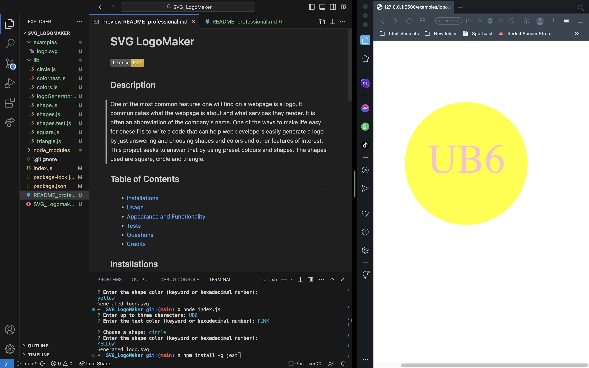

  # SVG LogoMaker
  
  ## Description
  One of the most common features one will find on a webpage is a logo. It communicates what the webpage is about and what services they render. It is often an abbreviation of the company's name. One of the ways to make life easy for oneself is to write a code that can help web developers easily generate a logo by just answering and choosing shapes and colors and other features of interest. This project seeks to answer that by using preset colours and shapes. The shapes used are square, circle and triangle.
  
  ## Table of Contents
  - [Installations](#installations)
  - [Usage](#usage)
  - [Appearance and  Functionality](#Appearance&Functionality)
  - [Tests](#tests)
  - [Questions](#questions)
  - [Credits](#Credits)
  
  ## Installations
  1. Run npm init -y in a terminal. 
  2. Install "[Inquirer](https://www.npmjs.com/package/inquirer/v/8.2.4)" and "[Jest](https://jestjs.io/docs/getting-started)" packages by typing and entering in a console "npm install inquirer" and "npm install -g jest". 
  
  ## Usage
  To run the logo generator type and enter in a terminal "node index.js" and answer all onscreen questions.

  ## Appearance and  Functionality
  Click on [SVG_Logomaker](https://watch.screencastify.com/v/yhLES0HbQH4XGFXqf9IP) to watch the video walkthrough.
  

  ## Tests
  Type and enter either "npm test" or "jest" in a terminal. 
  
  ## Questions
  For any questions or suggestions, feel free to reach out to me on GitHub: [StanOp09](https://github.com/StanOp09) or via email: stanleykaopare@gmail.com.
  
  ## Credits
  - Sean Roshan
  - Chat GPT
  - [NPM](https://www.npmjs.com/)
  - [NodeJS](https://nodejs.org/en)
  - [Inquirer](https://www.npmjs.com/package/inquirer)
  - [Jest](https://jestjs.io/docs/getting-started)